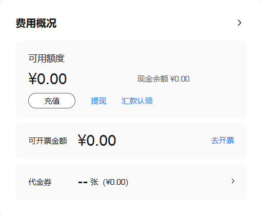

# 介绍
本项目通过使用GPT API生成数据并微调Qwen模型。采用闭源模型生成多模态数据（主要是VQA任务），并将生成的数据转化为Swift框架可用的JSON格式，然后使用Qwen模型进行微调。
你需要自己提供图片数据集，以及对应的指令prompt，并配置API。整体思路是用给定的prompt和图片生成问题，然后使用GPT API生成答案，拿这个答案去微调qwen。注意，这种方法并不保证生成的数据质量，因为GPT API生成的数据可能并不准确。

目前只提供LoRA微调方法，后续可能会配置更多微调方法。

# 所需环境
建议使用python3.10,并使用pip进行安装：
```
pip install ms-swift -U
pip install qwen-vl-utils==0.0.8
```
运行过程中遇到部分模型需要的包，请自行安装。另外cuda和cudnn等配置这里不再赘述。

# 使用方法

克隆本仓库后，进入项目文件夹并按照以下步骤操作：

1. 配置Prompt数据和API。
2. 运行 `process_all_image` 处理数据。
3. 最后运行 `training.py` 进行模型微调。

### 配置Prompt数据和API

1. **配置Prompt**  
   - 在 `script/config/prompt.py` 中配置两个Prompt：
     - **系统Prompt (`system_prompt`，选填)**：用于配置大模型生成数据时使用的系统Prompt，例如：“你是一个XX助手”。
     - **用户Prompt**：直接发送给大模型的Prompt，默认只需配置此项。示例prompt是对UI图片的功能理解。
   
2. **配置API**  
   - 在 `script/config/api.py` 中配置大模型API的URL和Key：
     - 如果使用官方的GPT API，URL无需修改。
     - 如果使用转发API，请根据转发接口填写相关信息。

3. **放置图片数据集**  
   - 在 `data/image` 中放入你的图片数据：
     - 示例数据集是一些UI图片，请根据你的任务和prompt做修改。

### 生成数据

运行以下命令来生成数据：

```bash
python process_all_image.py \
  --image_folder data/image \
  --output_json data/responses.json \
  --max_retries 3
```
说明:
可修改参数如下
- `--image_folder`：指定图像数据的文件夹路径。你可以在里面放入图像文件，只要能够配合你上一步配置的prompt生成数据即可。
- `--output_json`：生成的JSON数据保存路径。
- `max_retries`: （选填）由于gpt api不一定稳定，生成数据过程中如果一旦网络波动就会失败，所以需要指定每条数据生成重试次数，默认为3次。

### 微调模型

使用以下命令来微调模型：

```bash
python train.py \
  --model_id_or_path Qwen/Qwen2.5-VL-7B-Instruct \
  --dataset data/sft_data.json \
  --output_dir checkpoints \
  --num_train_epochs 10 \
  --split_dataset_ratio 0.8

```

---
必填的是`model_id_or_path`和`dataset`，一个是模型类型，一个是数据集路径，其他参数可自行修改。

#### 输入参数说明
- --`cuda_devices`：CUDA设备ID，默认值为 0。用于指定要使用的CUDA设备。
- --`model_id_or_path`：模型的路径或ID，必填项。指定你要使用的模型路径或ID。
- --`system`：系统Prompt，默认值为 You are a helpful assistant.。用于大模型生成数据时的系统Prompt。
- --`output_dir`：输出目录，默认值为 checkpoint。模型训练过程中的输出将保存在此目录。
数据集相关配置
- --`dataset`：数据集路径，必填项。指定训练使用的数据集路径。
- --`data_seed`：数据划分的随机种子，默认值为 42。用于控制数据集划分时的随机性。
- --`max_length`：最大token长度，默认值为 2048。指定模型输入的最大token长度。
- --`split_dataset_ratio`：验证集的划分比例，默认值为 0.01。用于划分训练集与验证集的比例。
- --`num_proc`：数据加载时的进程数，默认值为 4。指定数据加载时使用的并行进程数。
模型名称和作者
- --`model_name`：模型的中文和英文名称，默认值为 ['小黄', 'Xiao Huang']。指定模型的名称，这个其实是为了让他有个自我认知。
- --`model_author`：模型的中文和英文作者，默认值为 ['魔搭', 'ModelScope']。指定模型的作者名称。
LoRA配置
- --`lora_rank`：LoRA的秩，默认值为 8。指定LoRA的秩。
- --`lora_alpha`：LoRA的alpha值，默认值为 32。指定LoRA的alpha值。
训练相关配置
- --`learning_rate`：训练时的学习率，默认值为 1e-4。指定优化器的学习率。
- --`per_device_train_batch_size`：每个设备的训练批量大小，默认值为 1。设置每个设备的训练批量大小。
- --`per_device_eval_batch_size`：每个设备的评估批量大小，默认值为 1。设置每个设备的评估批量大小。
- --`gradient_accumulation_steps`：梯度累积的步数，默认值为 16。指定梯度累积的步数。
- --`num_train_epochs`：训练的总周期数，默认值为 5。设置训练的总周期数。

### 推理测试
推理之前，你可能需要修改推理使用的prompt，在`script/config/infer_request.py`中配置，之后运行`inference.py`即可。
```
python run_infer.py \
  --model_path Qwen/Qwen2.5-VL-7B-Instruct \
  --checkpoint_path checkpoints \
  --cuda_device 0 \
  ```
#### 输入参数说明
- --`model_path`：模型的路径或ID，必填项。指定你要使用的模型路径或ID。
- --`checkpoint_path`：训练后的checkpoints保存目录，必填项。
- --`cuda_device`：使用的GPU设备，默认值为 0。指定使用的GPU设备。

# prompt编写指南
### 1. prompt编写原则
- **简洁明了**：prompt应该简洁明了，避免冗余信息。
- **明确意图**：明确表达用户的意图，避免歧义。
- **具体描述**：具体描述用户希望得到的信息，避免模糊不清。

### 2. prompt编写技巧
- **使用引导词**：在prompt中使用引导词，如“请”，“告诉我”，“帮我”等，可以引导用户按照你的期望进行回答。
- **使用具体描述**：在prompt中使用具体描述，如“请告诉我这张图片的内容”，“请帮我解释这个概念”等，可以引导用户提供具体的信息。
- **使用示例**：在prompt中使用示例，如“请告诉我这张图片的内容，例如：这张图片是一个女孩在玩滑板。”，可以引导用户按照你的期望进行回答。

# 效果展示
这里放了一些我做的UI VQA任务的效果。该任务旨在提取UI图片的结构化功能，并作为json数据返回，这个能力能够用在UI图片的检索里面。

任务的prompt范例：
```
帮我分析这个图片里组件传递的功能语义，功能语义描述了这个组件的抽象功能，例如展示数据、描述数据变化趋势等，请用json方式返回格式化的数据。例如，环形图通过环形的比例来比较不同类别的数据份额，直观地展示各部分占整体的比例关系，帮助用户快速感知不同类别的相对大小；环形的设计使中心区域可用于显示汇总数值，增强信息的整体理解；颜色的区分进一步加强对数据特征及其状态的认知，提高图表的可读性,示例如下：
{
  "组件名": "环形图组件",
  "功能": [
    {
      "描述": "展示数据的整体结构和各部分的占比",
      "细节": [
        "通过环形的比例来比较不同类别的数据份额",
        "帮助用户快速感知不同类别的相对大小"
      ]
    },
    {
      "描述": "在中心区域突出显示汇总或关键数值",
      "细节": [
        "环形图中心可放置总量或其他关键信息",
        "增强用户对整体数值的认知和理解"
      ]
    },
    {
      "描述": "通过颜色区分不同数据类别或状态",
      "细节": [
        "使用不同颜色来表示不同类别或状态",
        "提高图表可读性并便于快速对比"
      ]
    }
  ]
}
```
基本思路是写清楚自己的需求，然后给出例子。这也是VQA任务常见的prompt方法，注意，一定要结构清晰有条理，然后例子要定义清楚，如果没有例子，模型的返回有极大的随机性，基本上不能作为json去读取。

例如，我们对这样一个UI图片做类似的任务：

采用GPT4o模型，加上上面的prompt，回复是：

```
{
  "组件名": "费用概况组件",
  "功能": [
    {
      ....这里省略一些不重要的部分
    },
    {
      "描述": "提供提现和汇款认领功能",
      "细节": [
        "提现按钮允许用户将可用余额转出",
        "汇款认领链接帮助用户确认和领取已到账的款项"
      ]
    },
    {
      "描述": "展示可开票金额，便于财务管理",
      "细节": [
        "可开票金额部分显示用户当前可以申请发票的金额",
        "提供去开票链接，引导用户进行开票操作"
      ]
    }
  ]
}
```
```
如果没有微调的qwen2.5-3b返回是这样：

 "组件名": "费用概况组件",
  "功能": [
    {
      ....
    },
    {
      "描述": "提供充值和提现选项",
      "细节": [
        "包含一个'充值'按钮用于增加可用额度",
        "包含一个'提现'按钮用于减少可用额度"
       
      ]
    },
    {
      "描述": "显示可开票金额",
      "细节": [
        "显示可开票金额为0元",
        "方便用户了解当前是否可以开具发票"
      ]
    },
    ....
}
```
```
微调后的返回：

{
  "组件名": "费用概况组件",
  "功能": [
    {
      ......
    },
    {
      "描述": "提供充值和提现选项",
      "细节": [
        "包含一个'充值'链接用于增加可用额度",
        "提供一个'提现'链接以便用户将资金转出"
        "提供‘汇款认领’操作链接"
      ]
    },
    {
      "描述": "展示可开票金额",
      "细节": [
        "显示当前可开票金额为0元",
        "提供一个'去开票'链接以开始开具发票"
      ]
    }
    .....
  ]
  ```
  可以看到，微调后的模型返回更全面，而且很明显学习到了“链接”这件事。当然，你会发现没有微调的模型返回很多时候也差不多，这里我就不多加推测了。